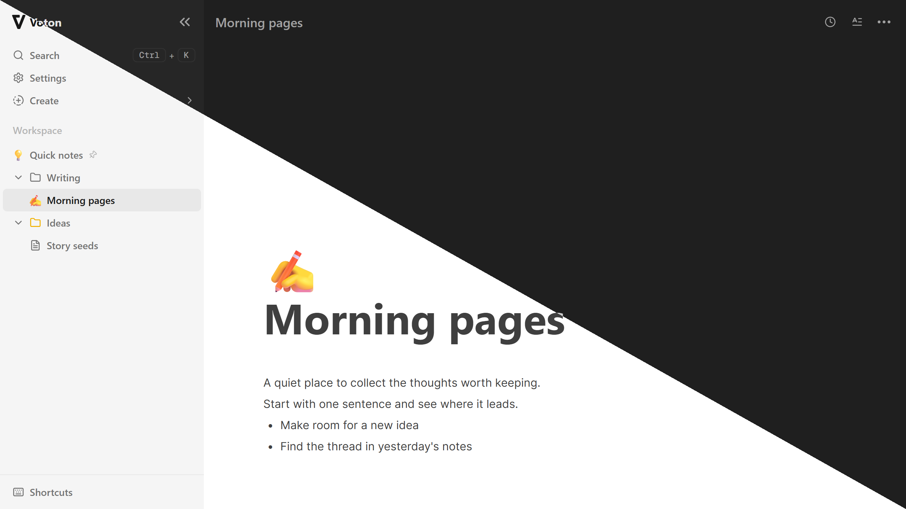

# Voton

A local-first writing workspace for your notes and ideas.

[Try Voton](https://voton.vercel.app/documents) · [Issues & ideas](https://github.com/Kaspiu/voton-app/issues)

Voton is an open-source, browser-based workspace for writing and organizing notes. Your pages and folders stay on your device, with no accounts, cloud sync or analytics in the app.



## Features

- **Write:** use a block editor with rich text, lists, tables and code blocks.
- **Organize:** nest pages in folders and search by page title or folder path.
- **Personalize:** add page emoji and cover images, and choose folder colors.
- **Focus:** choose light, dark or system theme, and hide navigation while writing.
- **Continue:** duplicate pages and choose whether to reopen your last page when you return.
- **Back up:** export JSON backups, import Voton backups or create pages from Markdown files.

## Run locally

Use **Node.js** and **npm**. No environment variables or external database are required.

### Development

```bash
git clone https://github.com/Kaspiu/voton-app.git
cd voton-app
npm ci
npm run dev
```

Open [localhost:3000](http://localhost:3000). The root address takes you to the workspace at `/documents`.

### Production

```bash
npm run build
npm run start
```

The build needs an internet connection to download the Geist fonts. Those fonts are then served with the app.

## Your data

Pages, folders and editor content are stored in IndexedDB in your browser. Small UI preferences use localStorage. Each browser profile and origin has its own workspace, so changing the domain, protocol or port does not transfer your notes automatically.

Use **Export data** in Workspace settings to save regular JSON backups. **Import data** merges a Voton JSON backup into the current workspace, or creates a new page from a Markdown file. Backups do not include UI preferences. Clearing site data or losing a browser profile can remove your workspace.

Voton does not provide encryption for stored notes. It also does not guarantee fully offline operation: the emoji picker loads images from jsDelivr, and external images, media or other content you add may contact their providers.

## Built with

Next.js, React, TypeScript, Tailwind CSS and BlockNote, with IndexedDB, `idb` and Zustand for local data and state.

## License

Voton is licensed under the [MIT License](LICENSE).
